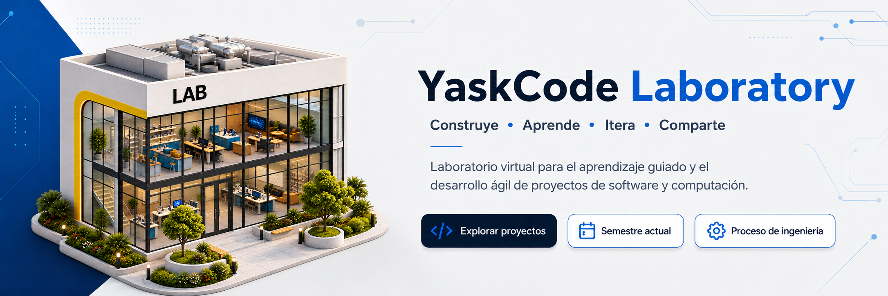

  

# YaskCode Laboratory

### Construye · Aprende · Itera · Comparte

**YaskCode Laboratory** es un laboratorio virtual para el aprendizaje guiado y el desarrollo de proyectos tecnológicos de pregrado y postgrado. Aquí, cada proyecto se convierte en una experiencia formativa: se diseña, construye, valida, documenta y comunica con prácticas profesionales de Ingeniería de Software.

Trabajamos con retos reales y evidencia verificable. El objetivo no es solamente entregar un producto: es aprender a construir conocimiento, tomar decisiones técnicas responsables y colaborar como en un entorno profesional.

## Una experiencia de ingeniería completa

El laboratorio integra el **Marco de Ingeniería YaskCode** para acompañar el proceso de principio a fin:

| Diseñar | Construir | Verificar | Compartir |
| --- | --- | --- | --- |
| Problema, requisitos, arquitectura y datos. | Iteraciones ágiles, GitHub Projects, código y automatización. | Testing, CI/CD, seguridad, revisión y métricas. | Documentación, autoría, trazabilidad y publicación responsable. |

Las decisiones se registran, los avances se hacen visibles y el aprendizaje se evalúa tanto en el producto como en el proceso que permitió crearlo.

## Prácticas que guían el laboratorio

- **Metodologías ágiles:** planificación por iteraciones, retrospectivas y mejora continua.
- **Gestión del trabajo:** GitHub Issues, GitHub Projects, pull requests y revisión colaborativa.
- **Ingeniería de Software:** requisitos, diseño, arquitectura, patrones, documentación y trazabilidad.
- **Calidad y entrega:** testing, integración y entrega continua (CI/CD), revisión de código y automatización.
- **Seguridad:** principios de desarrollo seguro, gestión responsable de dependencias y análisis de riesgos.
- **Métricas:** evidencia de calidad, cobertura, flujo de trabajo y aprendizaje.

## Project Passport

Cada equipo mantiene un **Project Passport**: una bitácora estructurada que reúne la intención del proyecto, sus decisiones, evidencias, resultados y fuentes. Este pasaporte permite comprender no solo *qué* se construyó, sino *por qué*, *cómo* y con qué criterios se validó.

El Project Passport conecta el trabajo cotidiano con la evaluación, facilita la continuidad entre iteraciones y prepara los proyectos para una comunicación académica y profesional responsable.

## Conocimiento abierto, con responsabilidad

Durante el semestre, los proyectos permanecen **privados** para proteger el proceso formativo, la retroalimentación y el trabajo de cada equipo. Después de la evaluación, algunos podrán hacerse públicos cuando hayan completado revisión, preparación, consentimiento de autoría y las condiciones de publicación aplicables.

Las publicaciones seleccionadas podrán contribuir a educación abierta, investigación y generación de nuevo conocimiento. Abrir un proyecto no es un paso automático: es una decisión consciente, documentada y respetuosa de las personas, las fuentes y el contexto.

## Fundamentos y referencias

El laboratorio toma como referencia el cuerpo de conocimiento **SWEBOK**, estándares **ISO/IEC/IEEE** y prácticas contemporáneas de ingeniería. Adaptamos estos referentes a un contexto educativo sin perder rigor técnico, trazabilidad ni responsabilidad profesional.

- [Proceso de ingeniería](../docs/ENGINEERING_PROCESS.md)
- [Metodología de trabajo](../docs/METHODOLOGY.md)
- [Estándares y principios](../docs/STANDARDS.md)

---

  Aprender ingeniería es construir con intención, evidencia y comunidad.

